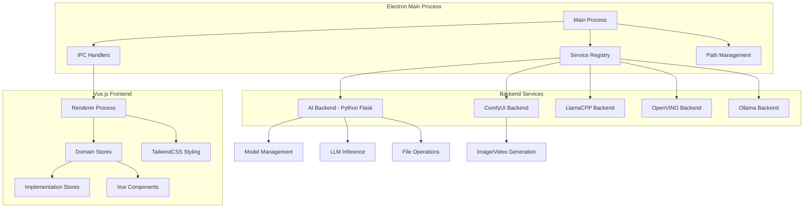
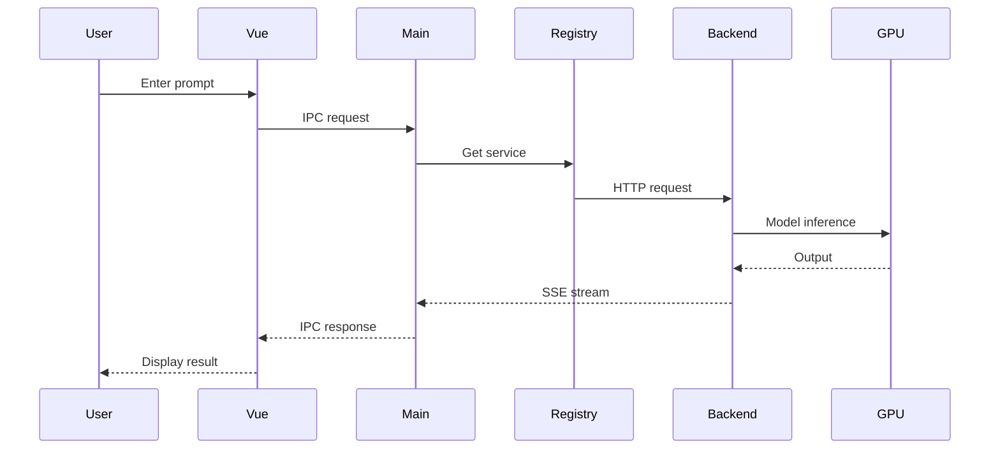
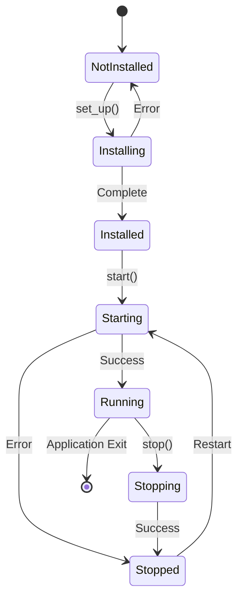

# AI Playground Architecture

This document provides a comprehensive overview of the AI Playground architecture, including its components, design patterns, and data flow.

## Table of Contents

1. [Overview](#overview)
2. [System Architecture](#system-architecture)
3. [Core Components](#core-components)
4. [Technology Stack](#technology-stack)
5. [Design Patterns](#design-patterns)
6. [Data Flow](#data-flow)
7. [Architecture Diagrams](#architecture-diagrams)

## Overview

AI Playground follows a **multi-process, multi-backend architecture** built on Electron. The application separates concerns across three layers:

1. **Frontend Layer** (Vue.js) - User interface and client-side logic
2. **Electron Main Process** - Service orchestration and IPC communication
3. **Backend Services** (Python) - AI model inference and processing

This architecture enables:
- **Offline AI capabilities** - All inference happens locally
- **Hardware optimization** - Leverages Intel Arc GPUs via specialized backends
- **Modularity** - Each AI task uses the most appropriate inference engine
- **Resource management** - Services can be started/stopped independently

## System Architecture

```
┌─────────────────────────────────────────────────────────────┐
│                     User Interface (Vue.js)                  │
│  ┌──────────────┐  ┌──────────────┐  ┌──────────────┐      │
│  │     Chat     │  │    Create    │  │   Settings   │      │
│  └──────────────┘  └──────────────┘  └──────────────┘      │
└────────────────────────┬────────────────────────────────────┘
                         │ IPC (electronAPI)
┌────────────────────────▼────────────────────────────────────┐
│              Electron Main Process                           │
│  ┌──────────────────────────────────────────────────┐       │
│  │           API Service Registry                   │       │
│  │  ┌────────┐ ┌────────┐ ┌────────┐ ┌────────┐   │       │
│  │  │ai-back │ │comfyui │ │llamacpp│ │openvino│   │       │
│  │  │end     │ │backend │ │backend │ │backend │   │       │
│  │  └────────┘ └────────┘ └────────┘ └────────┘   │       │
│  └──────────────────────────────────────────────────┘       │
└────────────────────────┬────────────────────────────────────┘
                         │ HTTP/WebSocket
┌────────────────────────▼────────────────────────────────────┐
│                  Backend Services (Python)                   │
│  ┌──────────┐  ┌──────────┐  ┌──────────┐  ┌──────────┐   │
│  │  Flask   │  │ ComfyUI  │  │ Llama.cpp│  │ OpenVINO │   │
│  │   API    │  │  Server  │  │  Server  │  │  Server  │   │
│  └────┬─────┘  └────┬─────┘  └────┬─────┘  └────┬─────┘   │
│       │             │              │              │          │
│  ┌────▼─────────────▼──────────────▼──────────────▼─────┐  │
│  │              AI Model Inference Layer                  │  │
│  │  PyTorch | Diffusers | Llama.cpp | OpenVINO | IPEX   │  │
│  └────────────────────────────────────────────────────────┘  │
└───────────────────────────────────────────────────────────────┘
                         │
┌────────────────────────▼────────────────────────────────────┐
│                   Intel Arc GPU / iGPU                       │
└──────────────────────────────────────────────────────────────┘
```

## Core Components

### 1. Frontend Layer (WebUI/src/)

**Technology**: Vue 3 with Composition API, TypeScript, TailwindCSS

#### Structure
```
WebUI/src/
├── main.ts                    # Vue app entry point
├── views/                     # Page-level components
│   ├── Chat.vue              # Chat interface
│   ├── WorkflowResult.vue    # Image generation UI
│   └── Settings.vue          # Configuration
├── components/               # Reusable UI components
│   ├── AipgInput.vue        # Custom input
│   ├── ModelSelector.vue    # Model picker
│   └── ...
└── assets/js/store/         # Pinia stores (state management)
    ├── backendServices.ts   # Backend service state
    ├── presets.ts           # Preset management
    ├── conversations.ts     # Chat history
    ├── models.ts            # Model management
    ├── imageGenerationPresets.ts  # Image gen orchestration
    ├── comfyUiPresets.ts    # ComfyUI workflow processing
    └── openAiCompatibleChat.ts    # Vercel AI SDK chat
```

#### Key Features
- **Pinia Stores**: State management with persistence via `pinia-plugin-persistedstate`
- **Domain-Driven Design**: Separation between domain stores (orchestration) and implementation stores (backend-specific)
- **Reactive Components**: Vue Composition API for reactive UIs
- **Type Safety**: Full TypeScript with strict mode
- **Vercel AI SDK**: OpenAI-compatible chat streaming with `@ai-sdk/vue`

### 2. Electron Main Process (WebUI/electron/)

**Technology**: TypeScript, Node.js, Electron APIs

#### Structure
```
WebUI/electron/
├── main.ts                     # Application entry, IPC handlers
├── preload.ts                  # Context bridge API exposure
├── subprocesses/
│   ├── apiServiceRegistry.ts  # Service lifecycle management
│   ├── service.ts             # Base service class
│   ├── aiBackendService.ts    # Primary backend
│   ├── comfyUIBackendService.ts
│   ├── llamaCppBackendService.ts
│   ├── openVINOBackendService.ts
│   └── ollamaBackendService.ts
├── pathsManager.ts            # Model path configuration
└── utils/
    ├── deviceDetector.ts      # Intel GPU detection
    └── comfyuiTools.ts        # ComfyUI management
```

#### Responsibilities
- **IPC Communication**: 80+ IPC handlers via `ipcMain.handle()` and `ipcMain.on()`
- **Service Orchestration**: Spawn, monitor, and control backend processes
- **Path Management**: Centralized model directory configuration
- **Security**: Context isolation and secure API exposure
- **Window Management**: Application lifecycle, dialogs, file operations

#### Service Registry Pattern
Each backend service implements the `ApiService` interface:

```typescript
interface ApiService {
  readonly name: string
  readonly baseUrl: string
  readonly port: number
  readonly isRequired: boolean
  currentStatus: BackendStatus
  isSetUp: boolean

  start(): Promise<BackendStatus>
  stop(): Promise<BackendStatus>
  set_up(): AsyncIterable<SetupProgress>
}
```

Services are registered in `ApiServiceRegistryImpl`:
- Manages service lifecycle (install → setup → start → stop)
- Handles port allocation
- Monitors process health
- Provides unified service information to UI

### 3. Backend Services

#### A. AI Backend (service/)

**Technology**: Python 3.11, Flask, APIFlask

**Purpose**: Primary backend for model management, LLM inference (via OpenAI-compatible API), and file operations

```
service/
├── web_api.py                 # Flask REST API
├── model_downloader.py        # HuggingFace downloads
├── comfyui_downloader.py      # ComfyUI custom node installer
├── config.py                  # Configuration
└── utils.py                   # Utilities
```

**Key Endpoints**:
```python
GET  /healthy                                    # Health check
POST /api/checkModelAlreadyLoaded              # Model cache validation
POST /api/downloadModel                        # Model download with progress
POST /api/comfyUi/checkWorkflowRequirements   # Workflow validation
POST /api/comfyUi/installCustomNode           # Install ComfyUI extensions
POST /api/comfyUi/installPythonPackage        # Install Python deps
```

**LLM Inference**:
- OpenAI-compatible API at `/v1/chat/completions`
- Streaming support via Server-Sent Events (SSE)
- Uses IPEX-LLM for Intel GPU optimization

#### B. ComfyUI Backend

**Technology**: ComfyUI (Python), Node.js-based workflow execution

**Purpose**: Exclusive handler for all image/video generation workflows (text-to-image, image-to-image, inpainting, outpainting, upscaling)

**Features**:
- Node-based workflow system
- Custom node support (install from GitHub)
- Real-time progress via WebSocket
- Workflow JSON format for pre-configured pipelines

**Communication**:
```
Frontend → Workflow JSON → ComfyUI API → Queue → Execution → WebSocket → Progress Updates
```

#### C. LlamaCPP Backend (LlamaCPP/)

**Technology**: llama.cpp with Vulkan backend

**Purpose**: CPU/GPU-optimized LLM inference for GGUF models

**Features**:
- OpenAI-compatible API (`/v1/chat/completions`)
- Quantized model support (Q4, Q8)
- Lower VRAM usage than PyTorch
- Hybrid CPU/GPU execution

#### D. OpenVINO Backend (OpenVINO/)

**Technology**: Intel OpenVINO Toolkit

**Purpose**: Intel-optimized inference for LLMs and vision models

**Features**:
- OpenAI-compatible API
- INT8/INT4 quantization
- Optimized for Intel hardware
- Fast inference on iGPU and Arc GPUs

#### E. Ollama Backend (preview)

**Technology**: Ollama

**Purpose**: Ollama model compatibility layer

**Features**:
- OpenAI-compatible API
- Ollama model format support
- Local model management

## Technology Stack

### Frontend
| Technology | Version | Purpose |
|------------|---------|---------|
| Vue.js | 3.5+ | Reactive UI framework |
| TypeScript | 5.8+ | Type safety |
| Pinia | Latest | State management |
| TailwindCSS | 4.1+ | Styling |
| Vite | 7.0+ | Build tool |
| Radix Vue | Latest | UI primitives (shadcn/vue) |
| Vercel AI SDK | Latest | LLM chat streaming |
| Zod | Latest | Schema validation |

### Desktop Framework
| Technology | Version | Purpose |
|------------|---------|---------|
| Electron | 37.2+ | Desktop app framework |
| Electron Builder | Latest | Packaging & installer |

### Backend
| Technology | Version | Purpose |
|------------|---------|---------|
| Python | 3.11 | Backend language |
| Flask | Latest | Web framework |
| APIFlask | Latest | API documentation |
| PyTorch | 2.10+ | Deep learning |
| Diffusers | Latest | Image generation |
| IPEX-LLM | Latest | Intel GPU optimization |
| OpenVINO | Latest | Intel inference runtime |
| llama.cpp | Latest | GGUF model inference |
| ComfyUI | Latest | Workflow-based generation |

### AI Libraries
| Library | Purpose |
|---------|---------|
| Transformers | LLM and embedding models |
| Sentence Transformers | Text embeddings |
| FAISS | Vector search (RAG) |
| PIL/OpenCV | Image processing |
| BasicSR | Super-resolution |

## Design Patterns

### 1. Service Registry Pattern

**Location**: `WebUI/electron/subprocesses/apiServiceRegistry.ts`

Centralizes management of all backend services:
```typescript
class ApiServiceRegistryImpl implements ApiServiceRegistry {
  private services: Map<BackendServiceName, ApiService>
  
  register(service: ApiService): void
  getService(name: BackendServiceName): ApiService | undefined
  getServiceInformation(): ApiServiceInformation[]
  startAll(): Promise<void>
  stopAll(): Promise<void>
}
```

**Benefits**:
- Unified service lifecycle management
- Consistent status monitoring
- Simplified service discovery
- Resource coordination

### 2. Domain-Driven Store Architecture

**Pattern**: Separation of orchestration logic from implementation details

**Domain Stores** (Orchestration):
- `imageGenerationPresets.ts` - Coordinates preset-based workflows
- `textInference.ts` - Manages LLM interactions
- `openAiCompatibleChat.ts` - Vercel AI SDK chat interface
- `backendServices.ts` - Backend service management

**Implementation Stores** (Backend-Specific):
- `comfyUiPresets.ts` - ComfyUI-specific workflow processing
- `models.ts` - Model discovery and management

**Example**:
```typescript
// Domain store delegates to implementation store
export const useImageGenerationPresets = defineStore('imageGenerationPresets', () => {
  const comfyUi = useComfyUiPresets() // Implementation store
  
  async function generate(mode: WorkflowModeType, sourceImage?: string) {
    // High-level orchestration
    await ensureModelsAreAvailable()
    await comfyUi.generate(imageIds, mode, sourceImage) // Delegate
  }
  
  return { generate, /* ... */ }
})
```

### 3. IPC Command Pattern

**Location**: `WebUI/electron/main.ts`, `WebUI/electron/preload.ts`, `WebUI/src/env.d.ts`

Three-file pattern for type-safe IPC communication:

**1. Main Process Handler** (`main.ts`):
```typescript
ipcMain.handle('getSystemInfo', async () => {
  return {
    platform: process.platform,
    arch: process.arch,
    nodeVersion: process.version
  }
})
```

**2. Preload Exposure** (`preload.ts`):
```typescript
contextBridge.exposeInMainWorld('electronAPI', {
  getSystemInfo: () => ipcRenderer.invoke('getSystemInfo')
})
```

**3. Type Definition** (`env.d.ts`):
```typescript
type electronAPI = {
  getSystemInfo(): Promise<{ platform: string; arch: string; nodeVersion: string }>
}
```

### 4. Async Generator for Progress Tracking

**Pattern**: Stream progress updates for long-running operations

```typescript
async *set_up(): AsyncIterable<SetupProgress> {
  yield { stage: 'downloading', progress: 0 }
  // Download logic...
  yield { stage: 'downloading', progress: 50 }
  // More logic...
  yield { stage: 'complete', progress: 100 }
}
```

Used for:
- Backend installation
- Model downloads
- Custom node setup

### 5. WebSocket Communication for Real-time Updates

**Pattern**: ComfyUI execution progress via WebSocket

```typescript
const ws = new WebSocket(`ws://localhost:${comfyUIPort}/ws`)

ws.onmessage = (event) => {
  const message = JSON.parse(event.data)
  
  switch (message.type) {
    case 'progress':
      updateExecutionProgress(message.data)
      break
    case 'executed':
      handleNodeCompletion(message.data)
      break
    case 'execution_error':
      handleExecutionError(message.data)
      break
  }
}
```

### 6. Strategy Pattern for Backend Selection

**Pattern**: Different inference backends for different use cases

```typescript
interface InferenceBackend {
  name: BackendServiceName
  supportsModel(modelType: string): boolean
  infer(input: InferenceInput): Promise<InferenceOutput>
}

// AI Backend: Full-featured, model management
// LlamaCPP: GGUF models, low VRAM
// OpenVINO: Intel-optimized, quantized models
// ComfyUI: Image/video generation workflows
```

## Data Flow

### LLM Chat Flow

```
1. User types message in Chat.vue
2. Vercel AI SDK (openAiCompatibleChat store) sends request
3. IPC: renderer → main process (electronAPI.chat)
4. Main process forwards to selected backend (ai-backend/llamacpp/openvino)
5. Backend calls inference engine (IPEX-LLM/llama.cpp/OpenVINO)
6. Streaming response: Backend → Main → Renderer (via SSE)
7. UI updates in real-time as tokens arrive
```

### Image Generation Flow (ComfyUI)

```
1. User selects preset + enters prompt in WorkflowResult.vue
2. imageGenerationPresets store validates models
3. comfyUiPresets store loads workflow JSON
4. Store modifies workflow with user settings:
   - Inject prompt, seed, dimensions
   - Apply model selections
   - Configure samplers
5. IPC: Submit workflow to ComfyUI backend
6. ComfyUI queues workflow for execution
7. WebSocket stream sends progress updates:
   - Node execution status
   - Intermediate previews
   - Final image output
8. Frontend downloads generated images
9. Images displayed in gallery
```

### Model Download Flow

```
1. User clicks "Download Model" in Settings
2. models store sends download request
3. IPC: renderer → main → ai-backend
4. ai-backend calls model_downloader.py
5. HuggingFace download with progress streaming
6. Progress updates via SSE: Backend → Main → Renderer
7. File saved to model directory
8. Model cache updated
9. UI reflects new model availability
```

### Service Lifecycle Flow

```
1. Application starts
2. Main process initializes ApiServiceRegistry
3. Registry registers all backend services
4. First run: UI shows Setup dialog
5. User clicks "Install"
6. For each service:
   a. service.set_up() async generator yields progress
   b. Downloads Python packages, models, dependencies
   c. IPC sends progress updates to UI
7. After setup: service.start() spawns Python subprocess
8. Service process starts Flask/HTTP server
9. Main process monitors process health
10. UI polls service status via IPC
11. Service marked as "Running" in UI
```

## Architecture Diagrams

### Component View



### Data Flow Diagram



### Service State Machine



## Architecture Evolution

### Historical Context

AI Playground has evolved from a monolithic architecture to the current multi-backend approach:

**Phase 1**: Single Python backend handling all AI tasks
**Phase 2**: Introduction of multiple backends with some logic duplication
**Phase 3** (Current): Refactoring toward domain-driven stores and clear separation of concerns
**Phase 4** (Future): Backends focused purely on inference, Electron handles all cross-cutting concerns

### Current Technical Debt

1. **Model management duplication**: Each backend partially handles model downloads (should be centralized)
2. **Cross-cutting concerns**: Some business logic scattered across services (should be in main process)
3. **Backend dependencies**: Services depend on ai-backend for shared functionality

### Future Vision

**Target Architecture**:
- **Inference-only backends**: Each backend focuses solely on model inference
- **Unified model management**: All model operations through main process
- **Consistent patterns**: Standardized approach across all backends
- **Simplified UI**: Single unified viewport for all AI tasks

For more details on the architectural evolution and future direction, see the [AGENTS.md](../AGENTS.md) file's "Development Philosophy & Future Direction" section.

## Performance Considerations

### Memory Management
- Services can be stopped independently to free GPU memory
- Model caching reduces reload times
- LRU cache for embedding models (RAG)

### Optimization Strategies
- **IPEX-LLM**: Intel GPU optimization for PyTorch models
- **OpenVINO**: INT8/INT4 quantization for faster inference
- **GGUF Quantization**: Reduced model size (Q4, Q8)
- **Async Processing**: Non-blocking UI during inference

### Resource Allocation
- Dynamic port allocation for services
- Process monitoring and auto-restart on crashes
- Timeout handling for long-running operations

## Security

### Context Isolation
- Electron context isolation enabled
- No direct Node.js access from renderer
- All operations through secure IPC bridge

### File System Access
- Sandboxed file operations
- Path validation to prevent traversal attacks
- Safe model directory management

### Network Security
- Local-only service binding (127.0.0.1)
- No external network calls without user consent
- Bearer token authentication for HuggingFace

## Testing Strategy

### Unit Tests
- Vitest for Vue components and stores
- Jest for Electron main process logic
- Python pytest for backend services

### Integration Tests
- IPC communication tests
- Service lifecycle tests
- Model download/inference tests

### E2E Tests
- User workflow simulations
- Cross-backend compatibility tests

## Related Documentation

- [GETTING-STARTED.md](./GETTING-STARTED.md) - User guide
- [API-REFERENCE.md](./API-REFERENCE.md) - API documentation
- [WORKFLOWS.md](./WORKFLOWS.md) - ComfyUI workflow guide
- [IPC-GUIDE.md](./IPC-GUIDE.md) - IPC communication patterns
- [CONTRIBUTING.md](../CONTRIBUTING.md) - Development guide
