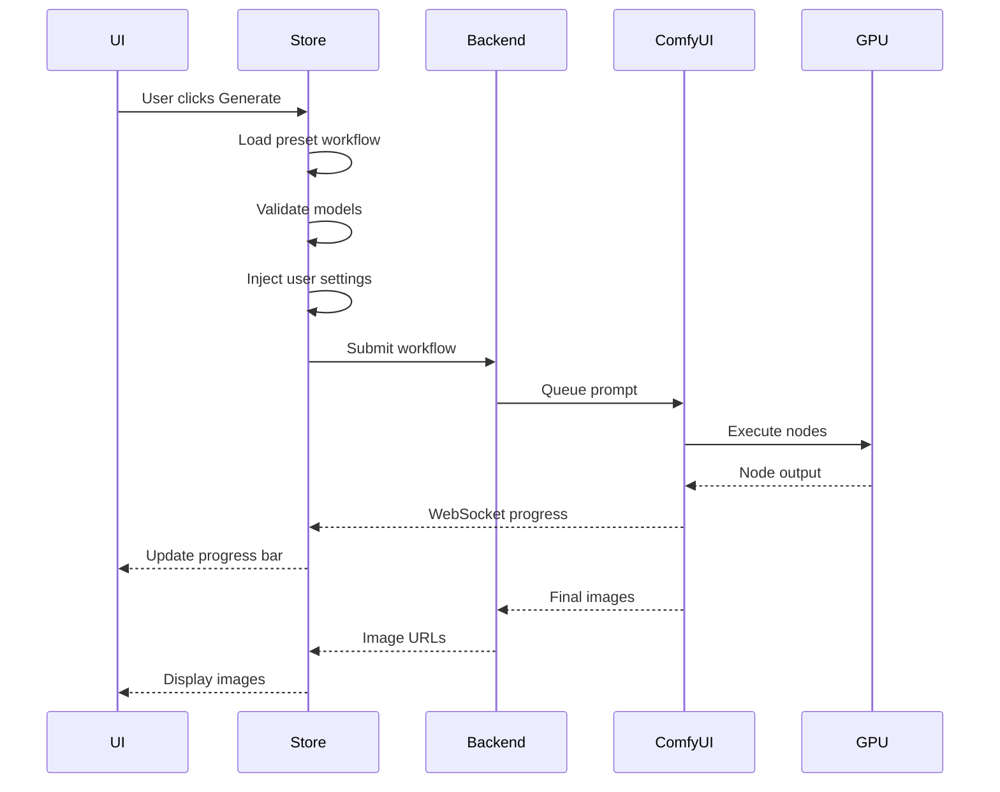

# ComfyUI Workflows Guide

This guide explains how ComfyUI workflows work in AI Playground, how to create custom workflows, and how to use the preset system for image and video generation.

## Table of Contents

1. [What is ComfyUI?](#what-is-comfyui)
2. [Workflow System Architecture](#workflow-system-architecture)
3. [Understanding Workflow JSON](#understanding-workflow-json)
4. [Creating Custom Workflows](#creating-custom-workflows)
5. [Preset System](#preset-system)
6. [Custom Nodes](#custom-nodes)
7. [Model Requirements](#model-requirements)
8. [Workflow Execution](#workflow-execution)
9. [Troubleshooting](#troubleshooting)

---

## What is ComfyUI?

ComfyUI is a powerful node-based interface for Stable Diffusion and other AI models. In AI Playground, **all image and video generation uses ComfyUI workflows** exclusively.

### Key Concepts

- **Nodes**: Individual processing units (e.g., load model, generate image, apply effects)
- **Connections**: Data flow between nodes
- **Workflows**: Complete pipelines from input to output
- **Custom Nodes**: Extensions that add new functionality

### Why ComfyUI?

- **Flexibility**: Build complex pipelines
- **Performance**: Optimized execution
- **Extensibility**: Rich ecosystem of custom nodes
- **Control**: Fine-grained parameter tuning

---

## Workflow System Architecture

```
User Selects Preset → Load Workflow JSON → Validate Dependencies
                                                ↓
                                        Install Custom Nodes
                                                ↓
                                        Check Required Models
                                                ↓
                                    Apply User Settings (prompt, seed, etc.)
                                                ↓
                                    Submit to ComfyUI Backend
                                                ↓
                                    Execute Workflow (node by node)
                                                ↓
                                    Stream Progress via WebSocket
                                                ↓
                                    Return Generated Images/Videos
```

### Components

1. **Frontend** (`imageGenerationPresets` store): Orchestrates workflow selection and model validation
2. **Implementation** (`comfyUiPresets` store): Handles ComfyUI-specific execution
3. **Backend** (ComfyUI service): Executes workflows and manages custom nodes
4. **Storage** (`WebUI/external/presets/`): JSON workflow definitions

---

## Understanding Workflow JSON

ComfyUI workflows in AI Playground are stored as JSON files with metadata.

### Basic Structure

```json
{
  "name": "My Workflow",
  "description": "Description of what this workflow does",
  "comfyUIRequirements": {
    "customNodes": [
      "https://github.com/user/repo@commit-hash"
    ],
    "pythonPackages": ["package-name"]
  },
  "requiredModels": [
    {
      "type": "checkpoint",
      "name": "Model Display Name",
      "path": "relative/path/to/model.safetensors",
      "url": "https://huggingface.co/...",
      "required": true
    }
  ],
  "comfyUiApiWorkflow": {
    "1": {
      "class_type": "CheckpointLoaderSimple",
      "inputs": {
        "ckpt_name": "model.safetensors"
      }
    },
    "2": {
      "class_type": "CLIPTextEncode",
      "inputs": {
        "text": "{{prompt}}",
        "clip": ["1", 1]
      }
    }
    // ... more nodes
  }
}
```

### Metadata Fields

#### `name` (required)
Display name shown in the preset selector.

#### `description` (optional)
Detailed description of the workflow's purpose.

#### `comfyUIRequirements` (optional)
Dependencies needed for the workflow.

- **`customNodes`**: Array of GitHub repository URLs with commit hashes
  - Format: `"https://github.com/user/repo@commit-hash"`
  - Commit hash is optional but recommended for stability
  
- **`pythonPackages`**: Array of Python package names
  - Installed via pip in the ComfyUI environment

#### `requiredModels` (optional but recommended)
List of models needed for the workflow.

```json
{
  "type": "checkpoint" | "lora" | "vae" | "controlnet" | "upscaler",
  "name": "Display name",
  "path": "relative/path/in/models/folder.safetensors",
  "url": "https://huggingface.co/...",  // Optional download URL
  "hash": "sha256:...",                  // Optional for verification
  "size": 7340032,                       // Optional file size in bytes
  "required": true,                      // Whether workflow can run without it
  "fallback": "alternative-model.safetensors"  // Optional fallback model
}
```

#### `comfyUiApiWorkflow` (required)
The actual ComfyUI workflow definition.

**Node Structure**:
```json
"nodeId": {
  "class_type": "NodeClassName",
  "inputs": {
    "parameter": "value",
    "connection": ["sourceNodeId", outputIndex]
  },
  "_meta": {
    "title": "Node Display Title"
  }
}
```

**Node Connections**:
- Literal values: `"text": "hello"`
- Node connections: `"clip": ["1", 1]` (node ID "1", output index 1)

### Variable Substitution

Use double curly braces for user-configurable values:

```json
{
  "inputs": {
    "text": "{{prompt}}",
    "width": "{{width}}",
    "height": "{{height}}",
    "seed": "{{seed}}"
  }
}
```

These are replaced with values from the UI settings when the workflow is executed.

---

## Creating Custom Workflows

### Step 1: Design in ComfyUI

1. **Launch ComfyUI**: Start the ComfyUI backend service
2. **Open Web UI**: Navigate to `http://localhost:8188`
3. **Build Workflow**: 
   - Add nodes (right-click → Add Node)
   - Connect nodes by dragging from outputs to inputs
   - Configure parameters
4. **Test**: Generate an image to verify the workflow works
5. **Export API**: Click "Save (API Format)" to get JSON

### Step 2: Add Metadata

Wrap the exported workflow in AI Playground metadata:

```json
{
  "name": "My Custom Workflow",
  "description": "A custom workflow for [specific purpose]",
  "comfyUIRequirements": {
    "customNodes": [
      "https://github.com/required/node@commit"
    ]
  },
  "requiredModels": [
    {
      "type": "checkpoint",
      "name": "Required Model",
      "path": "path/to/model.safetensors",
      "required": true
    }
  ],
  "comfyUiApiWorkflow": {
    // Paste exported workflow here
  }
}
```

### Step 3: Add Variable Placeholders

Replace hardcoded values with placeholders:

**Before**:
```json
{
  "inputs": {
    "text": "a beautiful landscape",
    "width": 512,
    "height": 512,
    "seed": 42
  }
}
```

**After**:
```json
{
  "inputs": {
    "text": "{{prompt}}",
    "width": "{{width}}",
    "height": "{{height}}",
    "seed": "{{seed}}"
  }
}
```

### Step 4: Save and Test

1. Save as `WebUI/external/presets/my-workflow.json`
2. Restart AI Playground
3. Select your workflow from the preset list
4. Test generation

---

## Preset System

### Preset Location

Presets are stored in:
- **Built-in**: `WebUI/external/presets/`
- **User**: (Future: user-defined preset folder)

### Preset Types

AI Playground recognizes three workflow modes:

1. **`imageGen`**: Text-to-image generation
2. **`imageEdit`**: Image editing (inpainting, outpainting, img2img)
3. **`video`**: Video generation

Specify the mode in preset settings or let the system auto-detect based on workflow structure.

### Loading Presets

Presets are loaded at application startup:

```typescript
// In imageGenerationPresets store
async function loadPresets() {
  const presetsPath = path.join(app.getPath('userData'), 'presets')
  const files = fs.readdirSync(presetsPath)
  
  for (const file of files) {
    if (file.endsWith('.json')) {
      const workflow = JSON.parse(fs.readFileSync(path.join(presetsPath, file), 'utf-8'))
      presets.push(workflow)
    }
  }
}
```

### UI Integration

Presets appear in the UI with:
- **Name**: From `name` field
- **Description**: From `description` field
- **Icon**: Auto-selected based on workflow type
- **Settings**: Configurable parameters exposed in UI

### Settings Mapping

Map UI settings to workflow nodes:

```typescript
// In comfyUiPresets store
const settingToComfyInputsName: Record<string, string[]> = {
  'prompt': ['text', 'positive'],
  'negativePrompt': ['negative'],
  'seed': ['seed', 'noise_seed'],
  'steps': ['steps'],
  'cfg': ['cfg'],
  'sampler': ['sampler_name'],
  'scheduler': ['scheduler'],
  'width': ['width'],
  'height': ['height'],
  'denoise': ['denoise']
}
```

When the workflow is executed, these settings are injected into the appropriate nodes.

---

## Custom Nodes

### What are Custom Nodes?

Custom nodes extend ComfyUI with new functionality:
- New samplers or schedulers
- Image processing effects
- Advanced control mechanisms
- Model-specific features

### Installing Custom Nodes

#### Via Workflow Requirements

Specify in the workflow JSON:

```json
{
  "comfyUIRequirements": {
    "customNodes": [
      "https://github.com/ltdrdata/ComfyUI-Manager@main",
      "https://github.com/WASasquatch/was-node-suite-comfyui@v1.2.3"
    ]
  }
}
```

AI Playground automatically installs these when the preset is first used.

#### Manual Installation

1. Go to **Settings → ComfyUI → Custom Nodes**
2. Enter the GitHub repository URL
3. Optionally specify a commit hash
4. Click **Install**
5. Wait for installation to complete
6. Restart ComfyUI backend

### Custom Node Format

Repository reference format:
```
https://github.com/user/repo@commit-hash
```

- **URL**: Full GitHub repository URL
- **@commit-hash**: Optional specific commit (recommended for stability)

### Managing Custom Nodes

#### List Installed Nodes

```typescript
const nodes = await window.electronAPI['comfyui:listInstalledCustomNodes']()
console.log(nodes)
// ["ComfyUI-Manager", "was-node-suite-comfyui", ...]
```

#### Check if Installed

```typescript
const installed = await window.electronAPI['comfyui:isCustomNodeInstalled'](
  'https://github.com/user/repo@commit'
)
```

#### Update Custom Node

Currently, updating requires:
1. Remove the node directory from `ComfyUI/custom_nodes/`
2. Reinstall with the new commit hash

---

## Model Requirements

### Specifying Required Models

```json
{
  "requiredModels": [
    {
      "type": "checkpoint",
      "name": "DreamShaper 8",
      "path": "DreamShaper_8_pruned.safetensors",
      "url": "https://huggingface.co/Lykon/DreamShaper/resolve/main/DreamShaper_8_pruned.safetensors",
      "size": 7340032000,
      "hash": "sha256:abc123...",
      "required": true,
      "fallback": "alternative-model.safetensors"
    }
  ]
}
```

### Model Types

- **`checkpoint`**: Main Stable Diffusion models (SD 1.5, SDXL, Flux)
- **`lora`**: LoRA adapters for style transfer
- **`vae`**: Variational autoencoders for image encoding/decoding
- **`controlnet`**: ControlNet models for guided generation
- **`upscaler`**: Super-resolution models
- **`embedding`**: Textual inversion embeddings

### Model Paths

Models are organized by type:
```
%USERPROFILE%\ai-models\
├── checkpoint\       # Main models
├── lora\            # LoRA adapters
├── vae\             # VAE models
├── controlnet\      # ControlNet models
└── upscale_models\  # Upscalers
```

When specifying `path` in `requiredModels`, use the path relative to the type folder:
```json
{
  "type": "checkpoint",
  "path": "subfolder/model.safetensors"
}
```
Resolves to: `%USERPROFILE%\ai-models\checkpoint\subfolder\model.safetensors`

### Auto-Download

If a model has a `url` field and isn't found locally, AI Playground can automatically download it:

1. User selects a preset
2. Missing models are detected
3. Download dialog appears
4. User approves download
5. Models are downloaded with progress tracking
6. Workflow can now execute

### Fallback Models

Specify a fallback if the primary model isn't available:

```json
{
  "type": "checkpoint",
  "name": "Primary Model",
  "path": "primary.safetensors",
  "required": false,
  "fallback": "secondary.safetensors"
}
```

If `primary.safetensors` isn't found, `secondary.safetensors` is used instead.

---

## Workflow Execution

### Execution Flow



### Progress Tracking

ComfyUI sends real-time progress via WebSocket:

**Connection**:
```typescript
const ws = new WebSocket(`ws://localhost:8188/ws?clientId=${clientId}`)
```

**Message Types**:

1. **Execution Start**:
```json
{
  "type": "executing",
  "data": {
    "node": "3",
    "prompt_id": "uuid"
  }
}
```

2. **Progress Update**:
```json
{
  "type": "progress",
  "data": {
    "node": "3",
    "prompt_id": "uuid",
    "value": 10,
    "max": 20
  }
}
```

3. **Node Complete**:
```json
{
  "type": "executed",
  "data": {
    "node": "7",
    "prompt_id": "uuid",
    "output": {
      "images": [{"filename": "img_001.png"}]
    }
  }
}
```

4. **Error**:
```json
{
  "type": "execution_error",
  "data": {
    "prompt_id": "uuid",
    "node_id": "5",
    "exception_message": "Model not found",
    "traceback": ["..."]
  }
}
```

### Handling Output

Generated images are saved to ComfyUI's output folder and accessed via URLs:

```typescript
// Download generated image
const imageUrl = `http://localhost:8188/view?filename=${filename}&subfolder=&type=output`
const response = await fetch(imageUrl)
const blob = await response.blob()
```

---

## Troubleshooting

### Workflow Validation Failed

**Symptom**: "Workflow requirements not met" error

**Causes**:
- Missing custom nodes
- Missing models
- Incompatible ComfyUI version

**Solutions**:
1. Check `comfyUIRequirements` in workflow JSON
2. Install missing custom nodes manually
3. Download required models
4. Update ComfyUI backend

### Custom Node Installation Failed

**Symptom**: Installation progress stops or errors

**Causes**:
- Network connectivity issues
- GitHub rate limiting
- Missing Python dependencies
- Incompatible node version

**Solutions**:
1. Check internet connection
2. Try again later (rate limit reset)
3. Install Python dependencies manually:
   ```bash
   cd ComfyUI/custom_nodes/<node-name>
   pip install -r requirements.txt
   ```
4. Check node compatibility with your ComfyUI version

### Model Not Found

**Symptom**: "Model X not found" error during execution

**Causes**:
- Model not downloaded
- Incorrect path in workflow
- Model in wrong folder

**Solutions**:
1. Download the model via Settings → Models
2. Verify model path matches workflow definition
3. Check model is in correct type folder (checkpoint, lora, etc.)
4. Use absolute path for debugging:
   ```typescript
   const modelPath = await window.electronAPI.getModelPaths()
   console.log('Checkpoint path:', modelPath.checkpoint)
   ```

### WebSocket Connection Failed

**Symptom**: No progress updates, workflow seems stuck

**Causes**:
- ComfyUI backend not running
- Port conflict
- Firewall blocking connection

**Solutions**:
1. Check backend status in Settings → Backends
2. Restart ComfyUI backend
3. Verify port 8188 is available:
   ```bash
   netstat -ano | findstr :8188
   ```
4. Check firewall settings

### Workflow Execution Timeout

**Symptom**: Workflow times out without completing

**Causes**:
- Complex workflow takes too long
- Insufficient GPU memory
- Deadlock in workflow logic

**Solutions**:
1. Simplify workflow (reduce steps, lower resolution)
2. Free GPU memory (close other apps, stop unused backends)
3. Increase timeout in workflow execution settings
4. Check for circular dependencies in node connections

### Out of Memory (OOM)

**Symptom**: "CUDA out of memory" or workflow crashes

**Causes**:
- Model too large for GPU
- High resolution images
- Multiple large models loaded

**Solutions**:
1. Use smaller models (quantized versions)
2. Reduce image resolution
3. Lower batch size
4. Enable model offloading (if supported)
5. Close other GPU-intensive applications

---

## Best Practices

### Workflow Design

1. **Start Simple**: Build workflows incrementally, testing at each step
2. **Name Nodes**: Use descriptive `_meta.title` for debugging
3. **Document**: Add comments in the JSON for complex logic
4. **Version Control**: Use commit hashes for custom nodes
5. **Test Thoroughly**: Verify with different inputs and settings

### Performance Optimization

1. **Reuse Nodes**: Don't duplicate nodes unnecessarily
2. **Cache Models**: Load models once and reuse across nodes
3. **Optimize Resolution**: Use appropriate resolution for the task
4. **Batch Processing**: Process multiple images together when possible
5. **Profile**: Use ComfyUI's profiling to identify bottlenecks

### Model Management

1. **Check Licenses**: Verify model licenses before distribution
2. **Provide Alternatives**: Specify fallback models
3. **Document Requirements**: Clearly list all required models
4. **Test Downloads**: Verify download URLs work
5. **Version Models**: Include model versions in filenames

### Custom Node Development

1. **Follow ComfyUI Guidelines**: Adhere to ComfyUI node development standards
2. **Handle Errors**: Implement proper error handling
3. **Document Inputs/Outputs**: Clearly document node interface
4. **Test Compatibility**: Test with multiple ComfyUI versions
5. **Provide Examples**: Include example workflows using your nodes

---

## Advanced Topics

### Dynamic Workflow Modification

Workflows can be modified programmatically before execution:

```typescript
// In comfyUiPresets store
function modifyWorkflow(workflow: ComfyUIApiWorkflow, settings: Record<string, any>) {
  // Inject user settings
  for (const [nodeId, node] of Object.entries(workflow)) {
    for (const [inputName, inputValue] of Object.entries(node.inputs)) {
      if (typeof inputValue === 'string' && inputValue.startsWith('{{')) {
        const settingKey = inputValue.slice(2, -2)
        node.inputs[inputName] = settings[settingKey] ?? inputValue
      }
    }
  }
  
  return workflow
}
```

### Workflow Chaining

Execute multiple workflows in sequence:

```typescript
async function executeChain(workflows: ComfyUIWorkflow[]) {
  let previousOutput: string | undefined
  
  for (const workflow of workflows) {
    if (previousOutput) {
      // Inject previous output as input
      injectSourceImage(workflow, previousOutput)
    }
    
    const result = await executeWorkflow(workflow)
    previousOutput = result.images[0]
  }
  
  return previousOutput
}
```

### Conditional Execution

Skip nodes based on conditions:

```typescript
function conditionalWorkflow(workflow: ComfyUIApiWorkflow, condition: boolean) {
  if (!condition) {
    // Remove optional nodes
    delete workflow['optionalNodeId']
  }
  
  return workflow
}
```

---

## Related Documentation

- [ARCHITECTURE.md](./ARCHITECTURE.md) - System architecture
- [API-REFERENCE.md](./API-REFERENCE.md) - API documentation
- [DEVELOPMENT.md](./DEVELOPMENT.md) - Development guide
- [ComfyUI Documentation](https://github.com/comfyanonymous/ComfyUI) - Official ComfyUI docs

---

## Contributing Workflows

To contribute your custom workflows to AI Playground:

1. **Create the workflow** following this guide
2. **Test thoroughly** with different settings
3. **Document requirements** (models, custom nodes)
4. **Submit a PR** to the AI Playground repository
5. **Include examples** of generated outputs

Your workflow will be reviewed and may be included in future releases!
